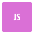

 

 
   

<!-- -->

  
  <h3>Git Status</h3>
   
  

  
  <h3>Highlight Pins</h3>
  </a>
  
  
  
  </a>
  <a href="https://github.com/WemellyNunes/Blender-3D-Assets">
     
  

<h3>Main Skills: </h3>
  
  
  
  
  
  
  

<h3>Tools: </h3>
  
  
  
  
  

  

##
